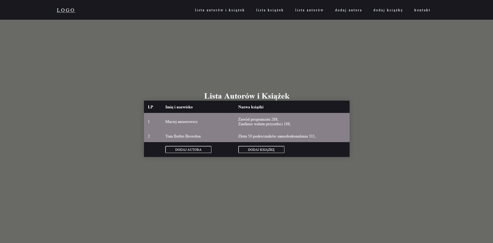
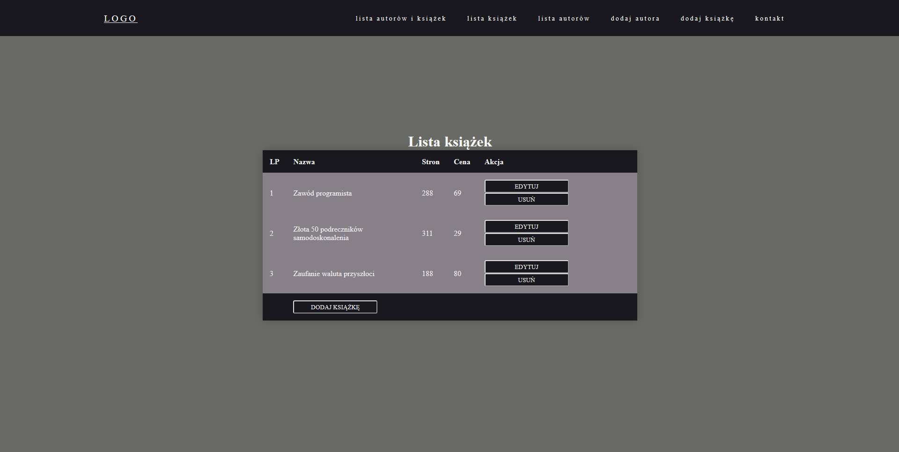
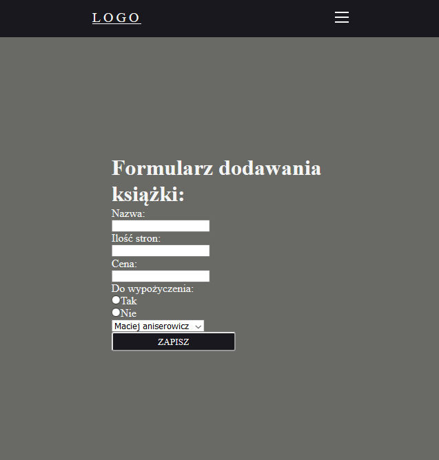
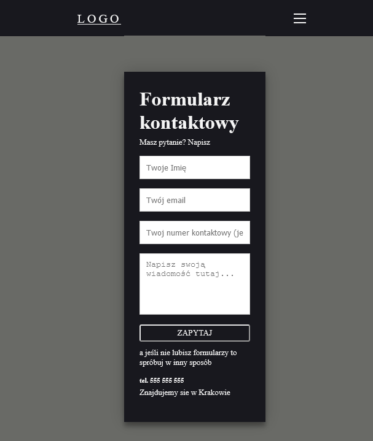

# libraryProject

CRUD book library application. It allows to create, remove and delete books and authors. Books and authorr are stored at two different tables in database and connected with foregin key. 

**Technologies**: Java, Spring, Maven, HTML, CSS, JavaScript Thymeleaf, Lombok, MySQL, H2, XAMPP 

**What have I learned new?**
  * What is Spring and how to create CRUD application
  * What is Maven and how to download dependencies from remote repository
  * How to connect backend with frontend
  * How to include Thymeleaf at html file
  * What are variables validations and how to create it
  * How to create forms 
  * How to send emails using Java
  * How to create tables in HTML and add CSS styles
  * How to create Burger menu
  
  **Screenshots:**

